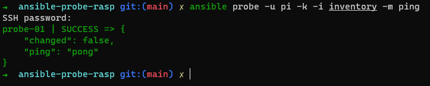
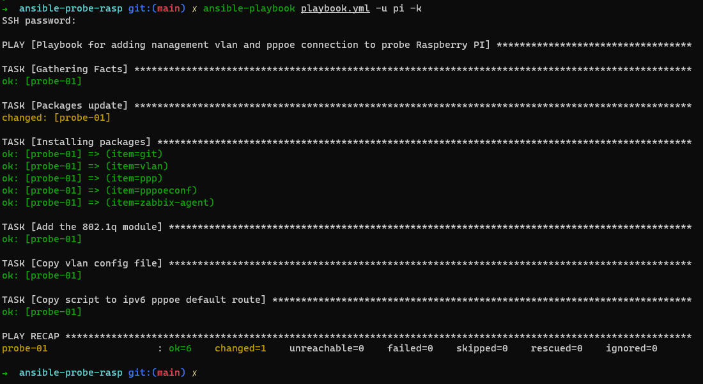

# Playbook para configuração de vlan de gerencia e pppoe no Raspberry PI

Playbook criado com o intuito de configurar um Raspberry PI para realizar uma conexão PPPoE para testes de ping, latêcia, etc... e com **zabbix-agent** no package. 

Será necessario criar o arquivo `inventory` para colocar o host a ser configurado e o arquivo `variables.yml` para a declaração das variaveis necessarias. 

### Exemplo para o arquivo de inventario

```
touch inventory
nano inventory
```
```
[probe]
probe-01   ansible_host='10.10.10.1

```

### Exemplo para o arquivo de variaveis

```
touch variables.yml
nano variables.yml
```
```
mngt:
  vlan: <vlan de gerencia>
  ip: '11.11.11.2/28'
  gtw: 11.11.11.1
  routes:    # IP/CIDR
    - '172.16.254.254/32'
    - '172.16.200.200/32'
    - '11.11.0.0/16'
    - '192.168.100.0/24'

```

#### Variaveis

| Nome          | Descrição                        | Tipo    |
| ------------- | -------------------------------- | ------- |
| `mngt.vlan`   | Vlan de gerencia                 | int     |
| `mngt.ip`     | Ip de gerencia / mascara         | IP/CIDR |
| `mngt.gtw`    | Gateway de gerencia              | IP      |
| `mngt.routes` | IP/CIDR para as adições de rotas | IP/CIDR |


Apos criar os aquivos, que tal testarmos se o Raspberry PI responde? 

```
ansible probe -u pi -k -i inventory -m ping
```



Se depois de colocar o password apareceu parecido com a imagem acima, então podemos rora a playbook. Caso tenha do erro, verifice se o ip, usuario e a senha estão corretos. 

```
ansible-playbook playbook.yml -u pi -k
```



:construction: Ainda está em testes a adição das configurações do PPPoE  :construction: